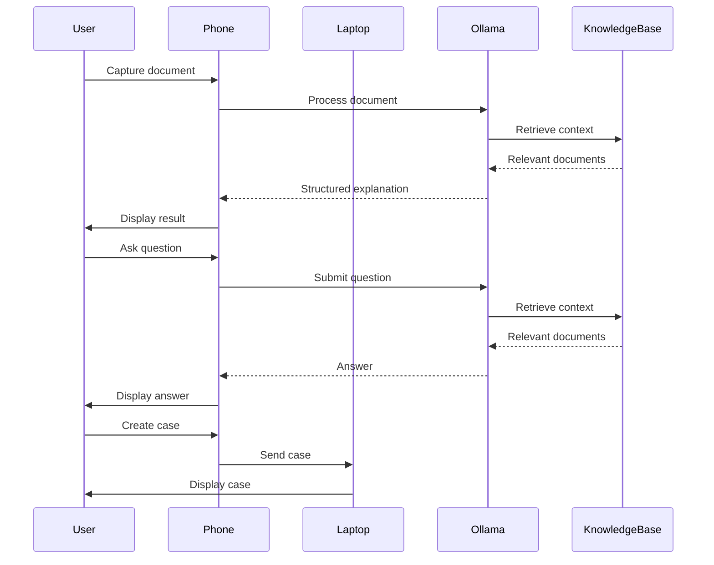

# GovLens Architecture Document

## 1. Executive Summary

GovLens is a mobile-first AI assistant designed to help citizens understand Indian government and public-service documents. The application leverages local AI processing to provide grounded, official information without requiring internet access.

## 2. System Architecture



## 3. Component Architecture

### Presentation Layer
- Mobile PWA interface
- Voice input/output
- Camera capture

### Application Layer
- Document processing workflow
- Case management

### AI Engine Layer
- `AIEngine` interface
- `OllamaGemmaEngine` implementation

### Knowledge Engine Layer
- `KnowledgeEngine` interface
- Local JSON/Markdown knowledge base

### Persistence Layer
- SQLite database

## 4. Data Flow

1. User captures document via camera or uploads existing document
2. Document is processed through OCR and sent to local AI engine
3. AI engine analyzes document and retrieves relevant context from knowledge base
4. AI engine generates structured explanation based on document and official context
5. User can ask follow-up questions about the current document
6. Extracted information is converted into actionable steps
7. Case is created and sent to laptop caseworker dashboard

## 5. AI Engine Interface

```typescript
interface AIEngine {
  analyzeDocument(document: Document): Promise<DocumentAnalysis>;
  answerQuestion(question: string, context: string): Promise<Answer>;
  extractFields(document: Document): Promise<ExtractedFields>;
}

interface DocumentAnalysis {
  documentType: string;
  language: string;
  summary: string;
  extractedFields: ExtractedFields;
  sources: Source[];
}

interface Answer {
  text: string;
  sources: Source[];
  verified: boolean;
}
```

## 6. Knowledge Engine Interface

```typescript
interface KnowledgeEngine {
  search(query: string): Promise<KnowledgeChunk[]>;
  getDocument(documentId: string): Promise<GovernmentDocument>;
  getSourceMetadata(sourceId: string): Promise<SourceMetadata>;
}
```

## 7. Repository Structure

```
app/
  components/
    CameraCapture.tsx
    DocumentUploader.tsx
    OCRViewer.tsx
    DocumentSummary.tsx
    StructuredFacts.tsx
    ActionChecklist.tsx
    VoiceInput.tsx
    VoiceOutput.tsx
    SourceCard.tsx
    CaseCard.tsx

  lib/
    ai-engine.ts
    knowledge-engine.ts
    ocr-service.ts
    voice-service.ts
    action-engine.ts
    case-management.ts

  services/
    api.ts
    persistence.ts

  types/
    document.ts
    ocr-result.ts
    government-source.ts
    knowledge-chunk.ts
    document-extraction.ts
    question.ts
    answer.ts
    case.ts
    checklist-item.ts
    action.ts

  data/
    documents/
      telangana/
      government-of-india/
    terminology.json

  public/
```

## 8. API Design

### POST /api/analyze

- Purpose: Analyze a document and return structured information
- Request: `{ document: File }`
- Response: `DocumentAnalysis`
- Error Responses: `400 Bad Request`, `500 Internal Server Error`
- Local: Yes
- Invokes: `OCRService`, `AIEngine`, `KnowledgeEngine`

### POST /api/ask

- Purpose: Answer a question about the current document
- Request: `{ question: string }`
- Response: `Answer`
- Error Responses: `400 Bad Request`, `500 Internal Server Error`
- Local: Yes
- Invokes: `AIEngine`, `KnowledgeEngine`

### POST /api/cases

- Purpose: Create a new case
- Request: `{ case: Case }`
- Response: `Case`
- Error Responses: `400 Bad Request`, `500 Internal Server Error`
- Local: Yes
- Invokes: `CaseManagement`

## 9. Data Models

```typescript
interface Document {
  id: string;
  content: string;
  language: string;
  type: string;
}

interface OCRResult {
  rawText: string;
  cleanedText: string;
  language: string;
  confidence: number;
}

interface GovernmentDocument {
  id: string;
  title: string;
  department: string;
  state: string;
  type: string;
  sourceUrl: string;
  language: string;
  publishedDate: string;
  effectiveDate: string;
  lastVerified: string;
  text: string;
}
```

## 10. Security and Privacy

- All processing happens locally on the device
- No authentication required for MVP
- No permanent upload of documents to third-party systems
- Clear distinction between local AI and future cloud AI
- Safe handling of OCR text
- Source traceability maintained throughout the workflow

## 11. Error Handling

- Camera permissions denied: Show permission request
- OCR failure: Show error message and allow retry
- Empty OCR output: Show error message and allow manual input
- Ollama unavailable: Show clear AI unavailable state
- Malformed JSON from model: Fallback to generic response
- Retrieval returns nothing: Show message indicating no relevant information found
- Microphone unavailable: Show error message and allow text input

## 12. Performance Targets

- OCR latency: < 5 seconds for typical document
- AI latency: < 10 seconds for typical document analysis
- Retrieval latency: < 2 seconds for typical query
- Initial page load: < 2 seconds
- Case creation: < 1 second

## 13. Demo-Critical Path

1. User captures document via camera
2. Document is processed through OCR
3. AI engine analyzes document and retrieves relevant context
4. AI engine generates structured explanation
5. User asks question about the document
6. AI engine provides grounded answer
7. User creates case
8. Case is sent to laptop caseworker dashboard

## 14. UI/UX Architecture

- Large touch targets for mobile interface
- Clear typography and visual hierarchy
- Minimal steps in workflow
- Strong source transparency
- Obvious actions for user interaction
- Microphone interaction for voice input/output
- Accessibility features for all users

## 15. Architecture Principles

1. Local-first processing
2. Phone-first experience
3. Government-source-grounded information
4. Modular AI provider
5. No unnecessary backend complexity
6. No generic PDF chatbot architecture
7. Structured outputs over free-form AI responses
8. Source traceability
9. User remains in control of government actions
10. Prototype must remain realistic to build quickly
11. Every major abstraction must have a reason
12. Architecture must be implementable by another coding agent

## 16. Future Considerations

- Semantic embeddings for improved retrieval
- Better multilingual speech recognition and synthesis
- On-device NPU inference for future production
- Larger government corpus
- More Indian languages
- Advanced caseworker functionality

## 17. Implementation Order

1. Set up project structure and basic components
2. Implement OCR service and document processing workflow
3. Develop AI engine interface and Ollama integration
4. Create knowledge engine and local retrieval
5. Build voice input/output functionality
6. Implement case management and phone-laptop workflow
7. Develop UI components and mobile interface
8. Add error handling and performance optimizations
9. Test and refine the application

## 18. Definition of Done

- All core features implemented
- Architecture documented
- Code reviewed and tested
- Performance targets met
- Demo-critical path working end-to-end

## 19. Risk Register

1. Ollama integration issues
2. Performance bottlenecks in document processing
3. Insufficient government knowledge base
4. Voice recognition accuracy problems
5. Phone-laptop connectivity issues

## 20. Dependencies

- Next.js
- TypeScript
- Tailwind CSS
- Ollama
- Tesseract.js
- SQLite

## 21. Commands and Configuration

- Install dependencies: `npm install`
- Start development server: `npm run dev`
- Run OCR service: `tesseract`
- Start Ollama server: `ollama serve`

## 22. Files to Create First

1. `app/components/CameraCapture.tsx`
2. `app/components/DocumentUploader.tsx`
3. `app/lib/ocr-service.ts`
4. `app/lib/ai-engine.ts`
5. `app/lib/knowledge-engine.ts`
6. `app/services/api.ts`
7. `app/types/document.ts`
8. `app/data/documents/telangana/`
9. `app/data/terminology.json`

## 23. Risks that Could Block the Demo

1. Ollama not running or properly configured
2. Tesseract.js OCR not working
3. Knowledge base not properly set up
4. Phone-laptop connection not established
5. Critical UI components not implemented

## 24. What Not to Build

- Cloud AI integration
- User authentication system
- Complex backend services
- Advanced semantic search

## 25. Final Architecture

The final architecture is a mobile-first application that leverages local AI processing to provide grounded, official information to citizens. The application consists of a mobile PWA interface, an AI engine layer, a knowledge engine layer, and a persistence layer. The data flow involves capturing a document, processing it through OCR, analyzing it with the AI engine, retrieving relevant context from the knowledge base, generating a structured explanation, and allowing users to ask follow-up questions. Extracted information is converted into actionable steps, and cases are created and sent to a laptop caseworker dashboard.

## 25. MVP Build Order

1. Set up project structure and basic components
2. Implement OCR service and document processing workflow
3. Develop AI engine interface and Ollama integration
4. Create knowledge engine and local retrieval
5. Build voice input/output functionality
6. Implement case management and phone-laptop workflow
7. Develop UI components and mobile interface
8. Add error handling and performance optimizations
9. Test and refine the application

## 26. Files the Coding Agent Should Create First

1. `app/components/CameraCapture.tsx`
2. `app/components/DocumentUploader.tsx`
3. `app/lib/ocr-service.ts`
4. `app/lib/ai-engine.ts`
5. `app/lib/knowledge-engine.ts`
6. `app/services/api.ts`
7. `app/types/document.ts`
8. `app/data/documents/telangana/`
9. `app/data/terminology.json`

## 27. Risks that Could Block the Demo

1. Ollama not running or properly configured
2. Tesseract.js OCR not working
3. Knowledge base not properly set up
4. Phone-laptop connection not established
5. Critical UI components not implemented

## 28. What Not to Build

- Cloud AI integration
- User authentication system
- Complex backend services
- Advanced semantic search